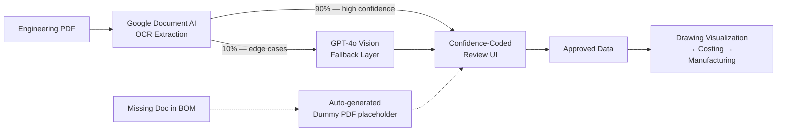

# [Specs Extraction System] — OCR + LLM Bulk Extraction for Engineering Drawings

> A human-in-the-loop extraction system that pulls product specifications from engineering documents in **5 minutes instead of 20** — with **zero downstream data misses**.

**Status:** 🟢 Live in production  
**Stack:** Google Document AI · OpenAI GPT-4o (Vision) · Python · Render

---

## The 30-second story

Design engineers spend ~20 minutes manually transcribing product specs (Quantity, Description, Material) from engineering drawings into a downstream Drawing Visualization system that feeds Costing and Manufacturing. Manual entry is slow, error-prone, and — because the data is mission-critical — engineers second-guess every entry: *"Did I miss something? Did I read that right?"*

This system bulk-extracts those fields, surfaces them in a confidence-coded review UI, and cuts per-document time **20 min → 5 min** while eliminating the silent data gaps that previously caused client delays.

---

## Who it's for

**Primary user:** Design engineers responsible for quoting and pre-manufacturing review of incoming engineering documents.

**Why they care:** They're a critical bottleneck. Their output feeds Costing → Manufacturing → Client commitments. A missed spec doesn't just cost them time; it cascades into delivery slips and revenue impact.

---

## What it does

- **Bulk-extracts product specs** (Quantity, Description, Material) from engineering PDFs
- **Confidence-coded review UI** — colors highlight low-confidence fields so engineers focus where it matters and glance past what's safe
- **Missing-document handling** — when the BOM references a drawing the client never shared, the system generates a placeholder PDF tagged `Missing`, creating an explicit slot downstream so nothing silently disappears
- **4x faster processing** with zero data-loss incidents since launch

---

## How it works

- **OCR does 90% of the work.** Google Document AI handles bulk extraction. Deterministic, layout-aware, source of truth for most fields.
- **LLM does 10%, narrowly.** GPT-4o is a *targeted fallback*, not a general extractor. It only kicks in for two specific cases OCR struggles with:
  - **Single-character ambiguity** (e.g., `6` vs `9` in low-resolution scans)
  - **Multiline spatial context** — wrapped text in table cells where OCR can't reliably tell which row a fragment belongs to
- **Review layer ties it together.** Every field is color-coded by confidence so engineer attention flows to risky items first.

---

## Key product decisions (and why)

**Accuracy > speed. Deterministic > probabilistic.**  
The obvious move was to throw the whole pipeline at an LLM. I didn't. Downstream costing decisions are made on this data — a hallucinated material spec could mis-quote a deal. OCR is deterministic; LLMs are not. So the architecture is "OCR as default, LLM as a narrow fallback for known weak spots." Probabilistic systems are powerful, but they don't belong everywhere.

**PaddleOCR → Google Document AI.**  
Started on PaddleOCR (open-source, fast to ship). Hit a wall on Render: compute costs scaled poorly with volume, and accuracy on edge cases wasn't enough. Moved to Google Document AI — pay-per-page, but extraction misses dropped to near-zero and it freed up budget to add the LLM fallback only where it earned its keep.

**Deliberately under-confident LLM outputs.**  
Even though GPT-4o's outputs are reliable in practice, I tag them at 50% confidence in the review UI. This *forces* human verification on the small set of fields the LLM touched. The product principle: trust in the system matters more than apparent autonomy. A user who reviews and never finds an error builds trust. A user who skips review and finds one error loses it permanently.

**Dummy PDFs for missing documents.**  
The detail I'm proudest of. Previously, when a BOM referenced a drawing the client never sent, that line item silently vanished downstream — no one knew until manufacturing flagged it weeks later. Now the system generates a placeholder PDF tagged `Missing`, with the expected document name, and inserts it into the downstream system. The gap becomes visible instead of invisible. Result: **zero silent misses**.

---

## Outcomes

| Metric | Before | After |
|---|---|---|
| Time per document | ~20 min | ~5 min |
| Silent data misses downstream | Recurring | 0 |
| Engineer trust in output | "What if I missed something?" | Reviewed and shipped |
| Client delays from missing data | Common | Eliminated |

---

## What I'd do differently

- **Build the eval set first.** I spent real effort on bounding-box preprocessing for multiline cells before accepting that an LLM fallback was simpler and more accurate. A proper eval harness up front would have shortcut that path by weeks.
- **Feed reviews back into the system.** Today, engineer corrections don't loop back. A v2 would capture them to refine prompts, detect drift, and gradually shrink the 10% edge-case bucket.
- **Real confidence calibration.** The 50% tag on LLM outputs is a heuristic, not a measured probability. With enough production data, this becomes a real calibrated score — and the review UI gets sharper.

---

## Roadmap

- [ ] Feedback loop — capture review edits to improve prompts and detect model drift
- [ ] Support for additional spec fields beyond Quantity / Description / Material
- [ ] Bulk re-processing UI for re-running extraction after model or prompt changes
- [ ] Calibrated confidence scores replacing the heuristic 50% tag

---

## Tech stack

- **OCR:** Google Document AI
- **LLM:** OpenAI GPT-4o (Vision)
- **Backend:** Python
- **Hosting:** Render
- **Frontend:** HTML/CSS/JS
- **Integration:** Drawing Visualisation System, PDF Creation

---

_Built by Vinay Singh Jadon · https://www.linkedin.com/in/vsjadon/_
